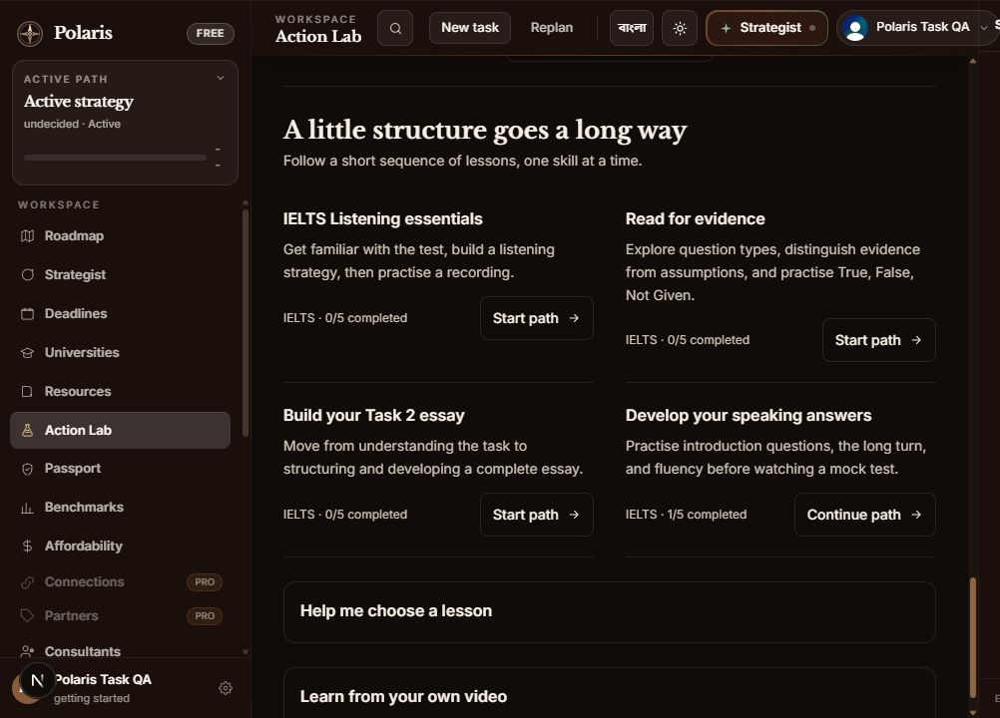
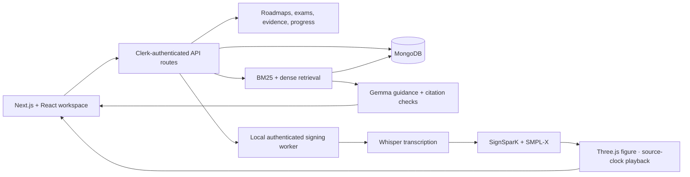

# Polaris

### Your academic goals. One connected workspace.

Polaris brings accessible video learning, IELTS and SAT practice, evidence-backed AI guidance, and adaptive admissions planning into one English–Bengali platform.

[Feature showcase](#feature-showcase) · [Quick start](#quick-start) · [ASL setup](docs/SIGN_LANGUAGE_PRODUCTION.md) · [Architecture](#architecture) · [Deployment](#deployment)

## Feature showcase

### Watch a lesson. Follow the signing.


**Model-generated ASL follows the lesson's playback clock.** Polaris transcribes English audio with Whisper, generates hand, body, and facial motion with SignSparK, and renders a licensed SMPL-X figure in Three.js. Pause the video and the figure pauses. Seek backward to revisit a section; seek forward and the worker prepares the requested section.

- Available in Video Learning and the timed IELTS Listening runner.
- Supports accessible YouTube audio and imported video or audio, including media outside the catalog.
- Generates eight-second sections with lookahead and explicit buffering when a section is not ready.
- Runs inference on a separately started local NVIDIA GPU worker.

> **Research feature:** the supported pairing is English audio → ASL. Generated signing requires linguistic review; it is not certified interpretation. Startup and uncached sections can take time. The current worker is local-only and is not included in a Vercel deployment. [Implementation, measurements, and limitations →](docs/SIGN_LANGUAGE_PRODUCTION.md)

### A learning library with a next step


**60 curated lessons across six IELTS and SAT skill areas**, with searchable titles, source attribution, checked video metadata, and actual durations. Filter by exam, skill, level, or length; save a lesson, track completion, and resume from your last position.



Six learning paths organize lessons into useful sequences: IELTS Listening, Reading, Writing, and Speaking, plus SAT algebra and reading/sentence skills. Changing a library filter keeps the current lesson playing. [Catalog and progress design →](docs/LEARNING_LIBRARY.md)

### Practise under exam conditions


Timed mock exams include a SAT Math module, a full adaptive SAT, and all four IELTS papers. Attempts support autosave and recovery. Results can propose targeted changes to the next week's study blocks; students review the proposal before applying it.

AI Practice generates original questions for a selected skill and difficulty. Practice results are unofficial and do not predict an official SAT score or IELTS band.

### Turn a goal into a working plan


The roadmap connects long-term goals to yearly missions, milestones, and weekly tasks. Decision Twin explores changed constraints, Evidence Graph connects claims to supporting artifacts, and Smart Routine turns available study time into editable blocks.

### Ask for guidance with sources


The Strategist combines a student's record with hybrid retrieval over the knowledge base. It streams guidance with citations, checks citation references, and flags unsupported figures. Optional web retrieval adds current sources. [Retrieval design and evaluation →](docs/RAG.md)

### Effort that becomes evidence


**Points measure the work, never the mark.** Sitting a timed exam section earns; the score on it never does, because rewarding outcomes takes recognition away from the students still improving. Every event carries a weight and the day is capped, so no amount of cheap repetition beats a real session. Students set their own weekly target rather than being handed one.

Coins accumulate from points and buy exactly two things: a streak freeze, so one missed day does not end a forty-day run, and the accent colour on the passport a recommender opens. They never buy a paid feature and never buy an achievement.


**Achievements are claims Polaris will make on a student's behalf.** Each states a countable fact — "Completed 10 practice exam sections under timed conditions" — with what it does *not* establish written next to it, and appears on the public passport in its own section, separate from the claims the student writes themselves. A student cannot edit them, which is what makes them worth reading.

### More of the workspace

| Capability | What students can do |
| --- | --- |
| University discovery | Explore sourced university information and academic fit estimates. |
| Affordability | Compare estimated costs, aid, scholarships, and funding gaps in BDT. |
| Student Passport | Share an unlisted profile with evidence-backed claims and verification dates. |
| Essay Studio | Extract English, Bengali, or mixed handwriting into an editable draft and request coaching. |
| Knowledge Notes | Retain feedback and connect it to future work. |
| Deadlines | Track risk and configure email or SMS reminders through optional providers. |
| Family and teacher views | Share role-scoped progress while keeping Strategist conversations private. |
| Achievements | Earn capped effort points, levels, and evidence achievements that publish to the passport. |
| Cohort benchmarks | Compare academic distributions; groups below 20 students are suppressed. |
| Connections | Connect supported providers with explicit scopes and revocation. |

<details>
<summary>See more product screens</summary>

**Decision Twin**


**Evidence Graph**


**Smart Routine**


**Essay Studio**


**University discovery**


**Verified Student Passport**


**Cohort benchmarks**


**Affordability**


**Deadlines**


**Plans and checkout**


</details>

Workspace screenshots are captured at 2× from the public `/demo` routes by `npm run screenshots -- --scale 2`, with the docked Strategist panel closed, so they use seeded data and never contain a real student's name, email, or plan. The ASL, library, learning-path, and Exam Lab images were captured by hand from a signed-in test account on **7 September 2026** using public lesson material. [Screenshot notes →](docs/screenshots/README.md)

## Quick start

### Application

Use Node.js 22 or newer, npm, a MongoDB connection, and a matching Clerk publishable/secret key pair.

```bash
git clone https://github.com/DesignNovae/Polaris.git
cd Polaris
npm ci
```

Copy `.env.local.example` to `.env.local`:

```powershell
# PowerShell
Copy-Item .env.local.example .env.local
```

```bash
# macOS / Linux
cp .env.local.example .env.local
```

Configure the application credentials, then start it:

```dotenv
MONGODB_URI=your_mongodb_connection_string
NEXT_PUBLIC_CLERK_PUBLISHABLE_KEY=your_clerk_publishable_key
CLERK_SECRET_KEY=your_clerk_secret_key
```

```bash
npm run dev
```

Open [localhost:3000](http://localhost:3000). The authenticated workspace uses MongoDB. `/demo` provides seeded product views, but the application still loads its environment configuration; it is not a replacement for configuring the required keys. Some live Action Lab features require sign-in.

### Optional AI guidance

Set `GEMMA_API_KEY` in `.env.local` to enable the Google AI Studio integration. Prepare the retrieval corpus with:

```bash
npm run rag:ingest
```

Optional provider failures have feature-specific fallbacks. Authentication and database configuration are still required for the full workspace.

### Optional local ASL worker

The signing service requires additional Python/CUDA dependencies, model checkpoints, FFmpeg, and your separately obtained SMPL-X model. These assets are not installed by `npm ci` and are not committed to this repository.

Follow the [complete signing setup](docs/SIGN_LANGUAGE_PRODUCTION.md), then run this in a second terminal:

```bash
npm run signing:worker
```

Enable the interpreter in Video Learning or IELTS Listening. The application and worker currently run on the same machine. The documented configuration has been exercised on an **RTX 3070 with 8 GB VRAM**; timing varies with source media, model initialization, and workload.

## Architecture



| Layer | Technology |
| --- | --- |
| Web application | Next.js 15, React 19, TypeScript |
| Interface | Tailwind CSS, Framer Motion, GSAP, Lenis |
| Identity and data | Clerk, MongoDB, Zod |
| AI guidance | Gemma through Google AI Studio; server-sent events |
| Retrieval | BM25, dense embeddings, weighted reciprocal-rank fusion |
| Sign production | Python, FastAPI, PyTorch, Whisper, SignSparK, SMPL-X |
| Avatar rendering | Three.js with buffered geometry synchronized to media time |
| Optional infrastructure | Upstash Redis, Tavily, notification providers, SSLCommerz |

```text
app/                    Pages, layouts, exam runners, and API routes
components/learning/    Lesson library and account progress UI
components/             Workspace, interpreter, exam, and shared components
data/learning/          Curated lesson metadata and additions
lib/learning/           Catalog, paths, filtering, and progress contracts
lib/interpreter/        Signing contracts, worker bridge, and playback support
lib/exams/              Exam assembly, sessions, scoring, and results
lib/rag/                Retrieval, embeddings, evaluation, and answer checks
lib/roadmap/            Planning, adaptation, and scheduling
lib/progress/           One recorder feeding streak, points, counters, badges
lib/xp/                 Effort-point weights, daily cap, levels
lib/badges/             Evidence achievement catalogue and awarding
lib/coins/              Coin wallet and the shop
services/signing/       Local GPU inference service and Python tests
scripts/                Model setup, catalog audits, screenshots, and evaluation
tests/                  TypeScript regression suites
docs/                   Technical documentation and product screenshots
```

## Configuration

Use [`.env.local.example`](.env.local.example) for application settings and the [signing guide](docs/SIGN_LANGUAGE_PRODUCTION.md) for worker settings. Never commit real credentials or licensed model files.

| Setting | Purpose |
| --- | --- |
| `MONGODB_URI` | Authenticated application data. |
| `NEXT_PUBLIC_CLERK_PUBLISHABLE_KEY`, `CLERK_SECRET_KEY` | Matching Clerk instance credentials. Only the publishable key belongs in browser code. |
| `APP_URL` | Canonical public origin, including payment callback generation. |
| `GEMMA_API_KEY`, `GEMMA_MODEL` | AI guidance and supported model selection. |
| `CLERK_WEBHOOK_SIGNING_SECRET` | Verify Clerk webhook events. |
| `UPSTASH_REDIS_REST_URL`, `UPSTASH_REDIS_REST_TOKEN` | Shared rate limits across application instances. |
| `TAVILY_API_KEY` | Optional web retrieval. |
| `ADMIN_EMAILS` | Administrative access allowlist. |
| `SSLCOMMERZ_*` | Optional payment gateway configuration. |
| `POLARIS_SIGNING_TOKEN`, `POLARIS_SMPLX_PATH` | Server-only worker authentication and licensed model location. |

## Development and verification

| Command | Purpose |
| --- | --- |
| `npm run dev` | Run the web application locally. |
| `npm run build` | Compile and validate the production application. |
| `npm run start` | Serve an existing production build. |
| `npm run lint` | Run ESLint with zero warnings allowed. |
| `npm test` | Run the TypeScript/Node regression suites. |
| `npm run signing:worker` | Start the configured local signing service. |
| `npm run signing:test` | Run Python signing tests using the documented Windows environment. |
| `npm run rag:test` | Run deterministic retrieval self-tests. |
| `npm run rag:eval` | Evaluate retrieval; requires the configured corpus and providers. |
| `npm run screenshots -- --scale 2` | Recapture the public demo targets at retina resolution. |

Focused library and interpreter checks:

```bash
node --import ./tests/register.mjs --test --test-isolation=none tests/learning.library.test.ts tests/interpreter.live.test.ts tests/interpreter.model.test.ts
```

The suites cover catalog and learning-path integrity, progress validation, media timing, ownership, exam access, scoring, and other domain contracts. Real GPU regression tests are opt-in; see the signing guide for measured runs and reproduction commands. Test counts and timings depend on the checkout and environment, so this README does not serve as a live CI status badge.

## Deployment

The Next.js application can be deployed to Vercel. Configure `MONGODB_URI`, `NEXT_PUBLIC_CLERK_PUBLISHABLE_KEY`, and `CLERK_SECRET_KEY` in the **environment being deployed**. Production settings do not automatically configure Preview; branch-specific Preview settings must match the branch.

`npm run build` runs a hosted-environment check before compilation. Missing Clerk keys intentionally fail the build. Use matching test keys for a test instance or matching live keys for a live instance. Legacy `NEXTAUTH_*` variables do not configure Clerk.

Configure `APP_URL`, MongoDB network access, and any enabled webhook, payment, notification, or retrieval providers before using their features. Use a shared rate-limit store for deployments with multiple instances.

**ASL deployment is separate.** The current web-to-worker bridge calls `127.0.0.1:8765`; Vercel cannot use that address to reach your PC. Hosting live signing requires a secured GPU service and changes to remote media transfer and worker configuration. A cloud GPU deployment or public tunnel is not included in the current implementation.

## Security, privacy, and limitations

- Authentication, role checks, and exam ownership are enforced on the server. Learning progress is scoped to the signed-in account.
- Signing requests require a server-only bearer token and owner identity. The worker limits uploads and concurrent jobs and removes expired job directories.
- The current signing worker is designed for local use. Public exposure requires additional isolation, access controls, and resource limits.
- Published student passports use unlisted URLs; teacher and family views apply role-specific scopes.
- Acceptance estimates and AI-generated practice are advisory. They are not admissions guarantees or official exam scores.
- Video metadata is checked when the catalog is refreshed. A third-party uploader can later remove a video or change embedding availability.
- ASL accuracy depends on transcription and model output. BSL and ISL are not supported in the live production path; generated signing needs an ASL-fluent review.
- The released SignSparK checkpoints have non-commercial research restrictions. SMPL-X requires its own registration and license acceptance; do not redistribute the model files. See the [upstream sources and license links](docs/SIGN_LANGUAGE_PRODUCTION.md#sources).
- Retrieval evaluation results and their dataset scope are documented in [RAG.md](docs/RAG.md). They should not be interpreted as guarantees for every question.

## Documentation

- [Learning library and catalog maintenance](docs/LEARNING_LIBRARY.md)
- [Sign language production, setup, benchmarks, and limitations](docs/SIGN_LANGUAGE_PRODUCTION.md)
- [Retrieval and grounding](docs/RAG.md)
- [Screenshot capture notes](docs/screenshots/README.md)
- [Environment template](.env.local.example)
- [Feature access rules](lib/features.ts)

Polaris is an actively developed university/research project. Feature availability depends on the configured services, account access, and deployment environment.
