<div align="center">


**An English–Bengali academic workspace for students applying abroad from Bangladesh.**

Polaris turns a distant university goal into the next concrete task, keeps the plan honest as scores and evidence arrive, and produces a record a recommender can actually check.


[Quick start](#quick-start) · [Architecture](#architecture) · [Configuration](#configuration) · [ASL setup](docs/SIGN_LANGUAGE_PRODUCTION.md) · [Retrieval design](docs/RAG.md)

</div>

<table>
<tr>
<td align="center" width="33%"><b>The plan</b></td>
<td align="center" width="33%"><b>The record</b></td>
<td align="center" width="33%"><b>The proof</b></td>
</tr>
<tr>
<td></td>
<td>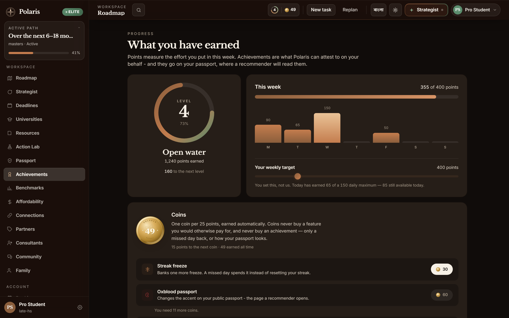</td>
<td>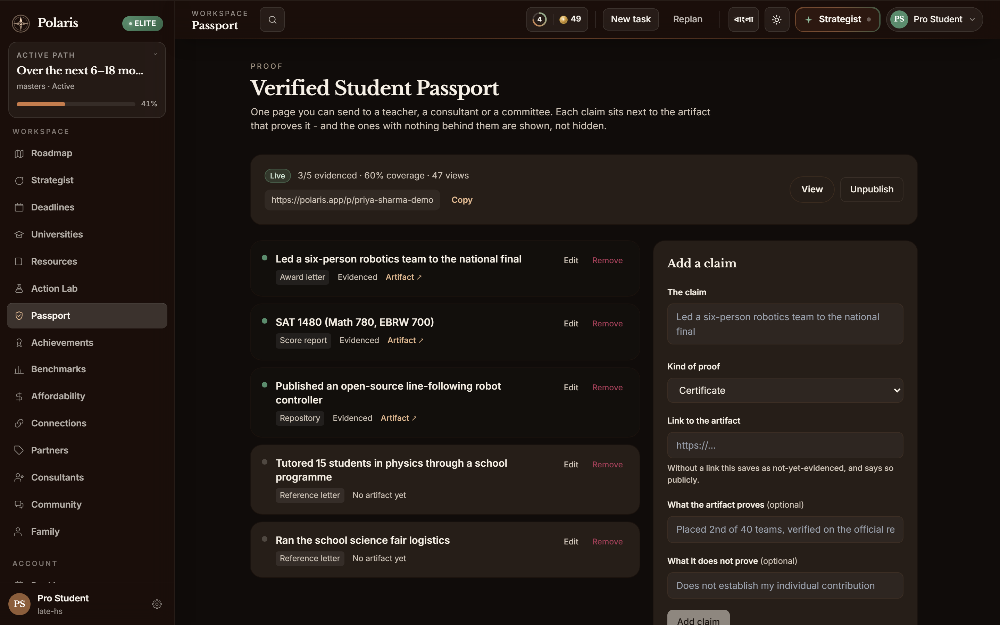</td>
</tr>
</table>

---

## How a student actually uses it

A student in Dhaka wants to study abroad. They know the destination and almost nothing about the route: which exam, by when, what counts as evidence, whether the family can pay for it. Polaris is the walk from that question to an answer, and the sections below are that walk in order.

### 1 · Start from the goal, not a blank calendar


You give Polaris a target — a country, a tier, a degree, a timeline. It generates a roadmap: long-term goals broken into yearly missions, milestones, and tasks small enough to finish this week. Nothing here is a template. The plan is built against this student's grades, curriculum, and target tier, and it is the thing every other surface reads from.

### 2 · Ask it why, and get sources back


The Strategist reads the student's own record alongside a knowledge base, using hybrid retrieval — BM25 for the exact terms, dense embeddings for the meaning, fused into one ranking. It streams answers with citations, checks that the citations actually support what was said, and flags figures it cannot ground. Asking "why am I at 41% for MIT?" gets an answer about *this* profile, not admissions advice in general. [Retrieval design and evaluation →](docs/RAG.md)

### 3 · Sit the paper under real conditions

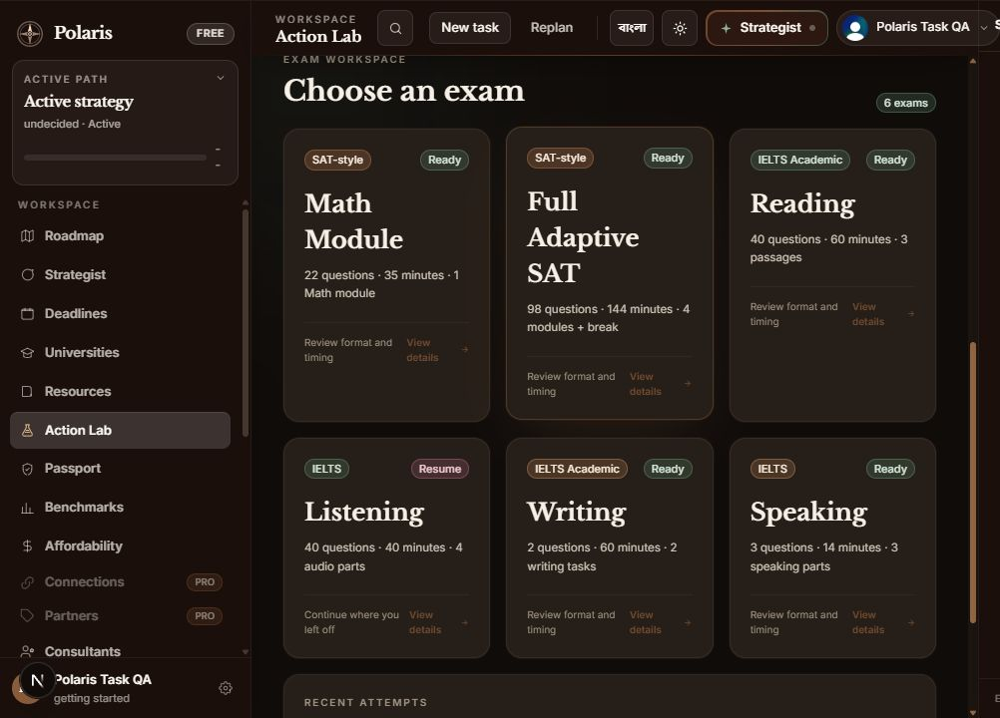

A full adaptive SAT, a SAT Math module, and all four IELTS papers — timed, autosaved, recoverable if the tab dies mid-attempt. When results arrive, Polaris proposes specific changes to next week's study blocks. The student reviews the proposal before anything moves; the plan is never rewritten behind their back.

> Practice results are unofficial and do not predict an official SAT score or IELTS band. Polaris says so on the results screen too.

### 4 · Learn the material, including without hearing it

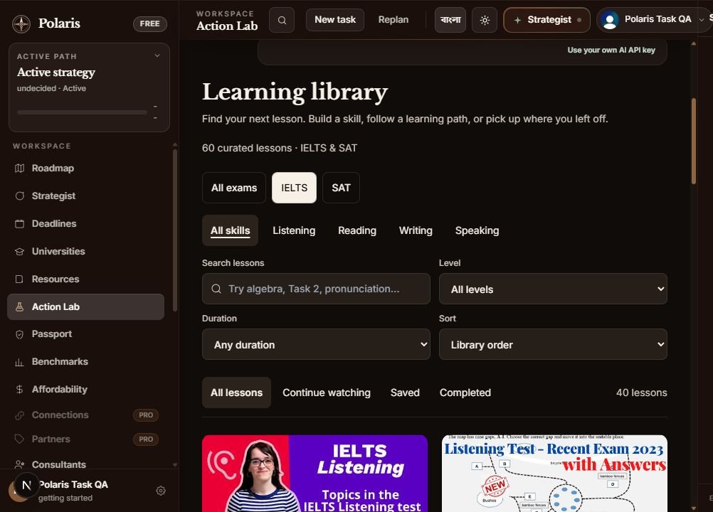

Sixty curated lessons across six IELTS and SAT skill areas, with checked durations, real source attribution, and resume-where-you-stopped.

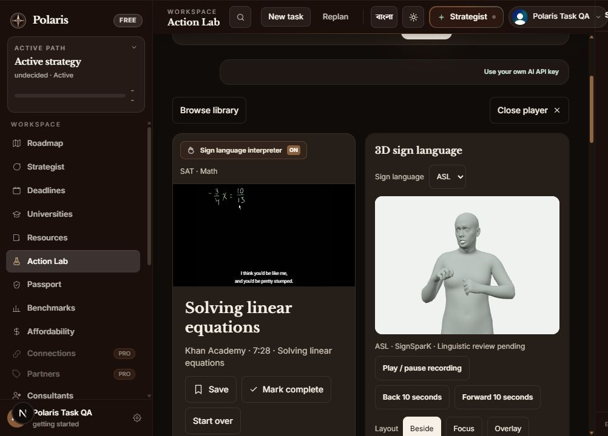

And for a deaf or hard-of-hearing student, the lesson can be signed. Polaris transcribes the English audio with Whisper, generates hand, body and facial motion with SignSparK, and renders a licensed SMPL-X figure in Three.js **against the video's own playback clock** — pause the lesson and the figure pauses; seek back and it follows.

> **Research feature.** The supported pairing is English audio → ASL. Generated signing needs linguistic review and is not certified interpretation. The worker is local-only and is not part of a Vercel deployment. [Implementation, measurements, and limitations →](docs/SIGN_LANGUAGE_PRODUCTION.md)

### 5 · Turn the week into something you can actually do

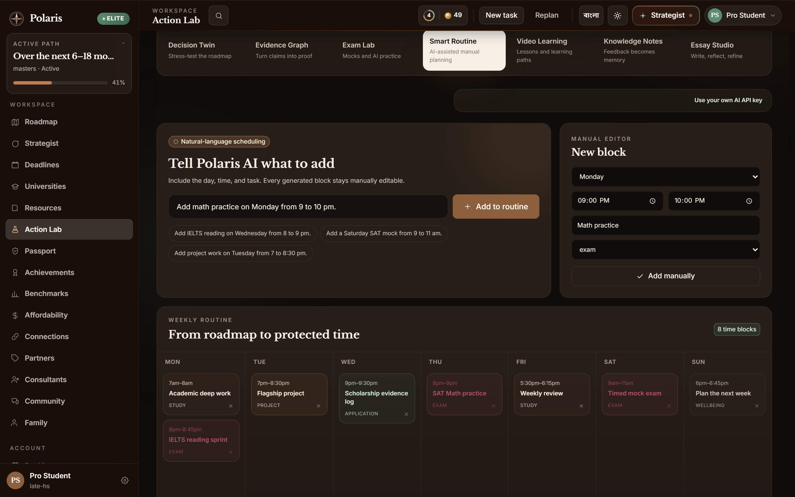

Action Lab is where the plan meets a real week. Smart Routine turns the hours a student actually has into editable blocks. Decision Twin answers "what if I sat the IELTS in March instead". Evidence Graph shows which claims have artifacts behind them and which are still just assertions.

### 6 · Never lose a date

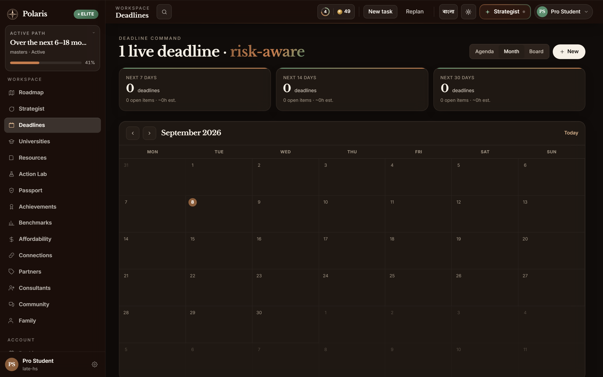

Every application deadline in one place, ranked by risk. Reminders go out by email or SMS on a schedule the student sets — SMS because in this market it is the channel that actually gets read.

### 7 · Find out whether the money works

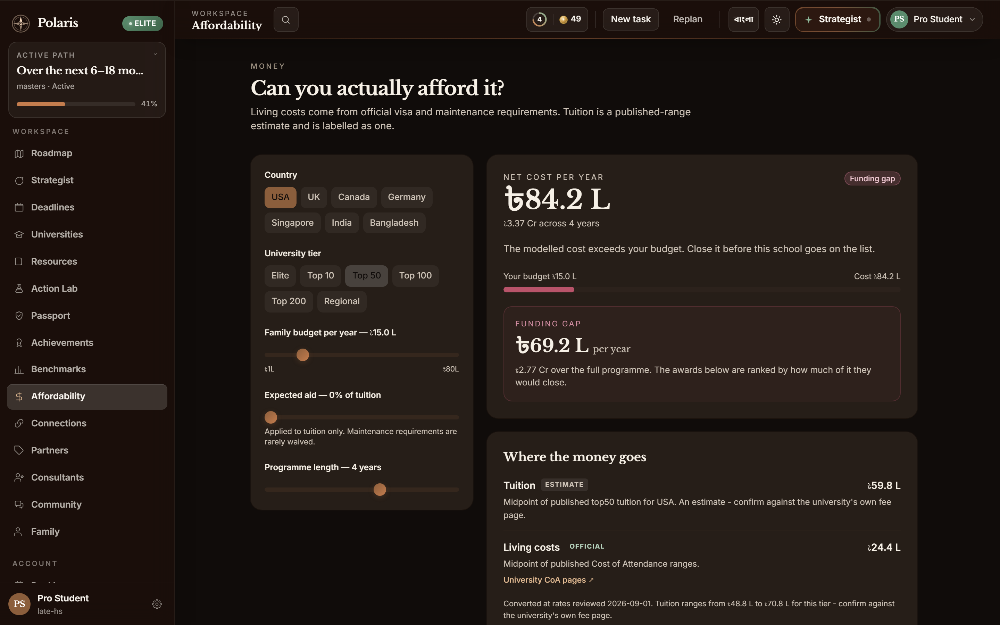

Costs, aid, scholarships, and the remaining gap, in BDT, before a student spends a year preparing for a place the family cannot fund. Living costs come from official visa and maintenance requirements; tuition is a published range and is labelled as one.

### 8 · See where you honestly stand

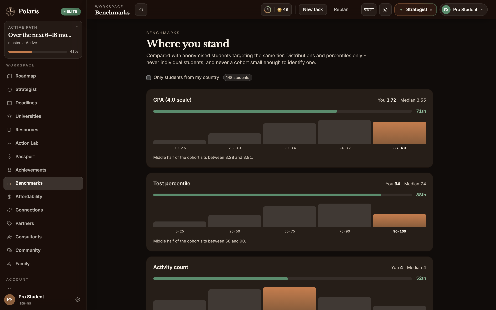

Compared with anonymised students targeting the same tier — as a distribution and a percentile, never a ranking. There is deliberately no leaderboard, and any cohort with fewer than 20 students is suppressed entirely rather than shown with a caveat, because in a group that small a percentile identifies someone.

### 9 · Get credit for the work, without cheapening it


Effort points measure what a day contained. Sitting a timed exam section earns; **the mark on it never does**, because rewarding outcomes takes recognition from exactly the students still improving. Every event has a weight, the day is capped, and the student sets their own weekly target.

Coins accumulate from points and buy two things: a streak freeze so one missed day does not end a forty-day run, and the accent on the passport below. They never buy a paid feature and never buy an achievement.

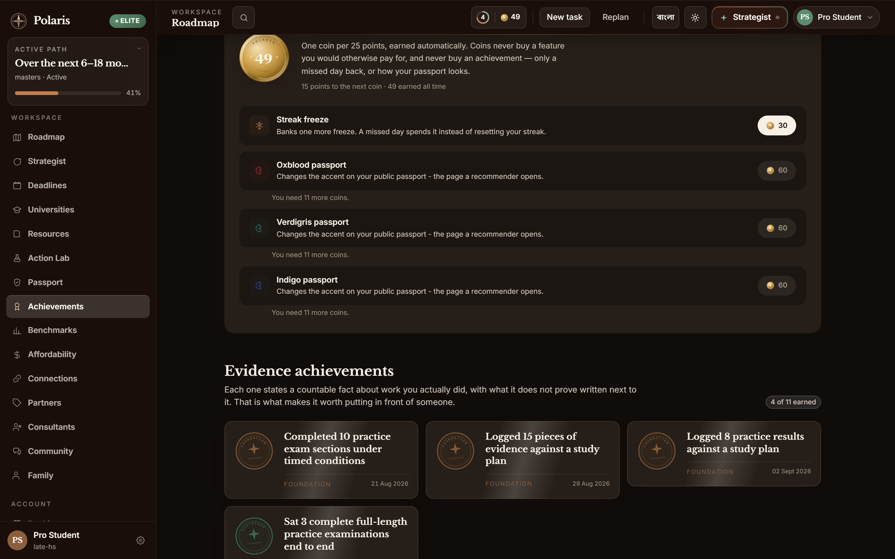

### 10 · Leave with something checkable


The Verified Student Passport is one unlisted page a student sends to a teacher, a consultant, or a committee. Each claim sits beside the artifact that proves it and the date it was verified — **and the claims with nothing behind them are shown, not hidden**, because a page that only shows the good half is a CV with extra steps.

Achievements appear in their own section, marked as attested by Polaris rather than by the student. The student cannot edit those, which is exactly what makes them worth reading.

<details>
<summary><b>More of the workspace</b></summary>

<br>

| Capability | What students can do |
| --- | --- |
| University discovery | Explore sourced university information and academic fit estimates. |
| Essay Studio | Extract English, Bengali, or mixed handwriting into an editable draft and request coaching. |
| Knowledge Notes | Retain feedback and connect it to future work. |
| Family and teacher views | Share role-scoped progress while keeping Strategist conversations private. |
| Connections | Connect supported providers with explicit scopes and revocation. |
| Consultants | Book verified mentors, with the first session free where offered. |
| Billing | Plans and checkout through SSLCommerz — card, bKash, Nagad, Rocket. |

**University discovery**

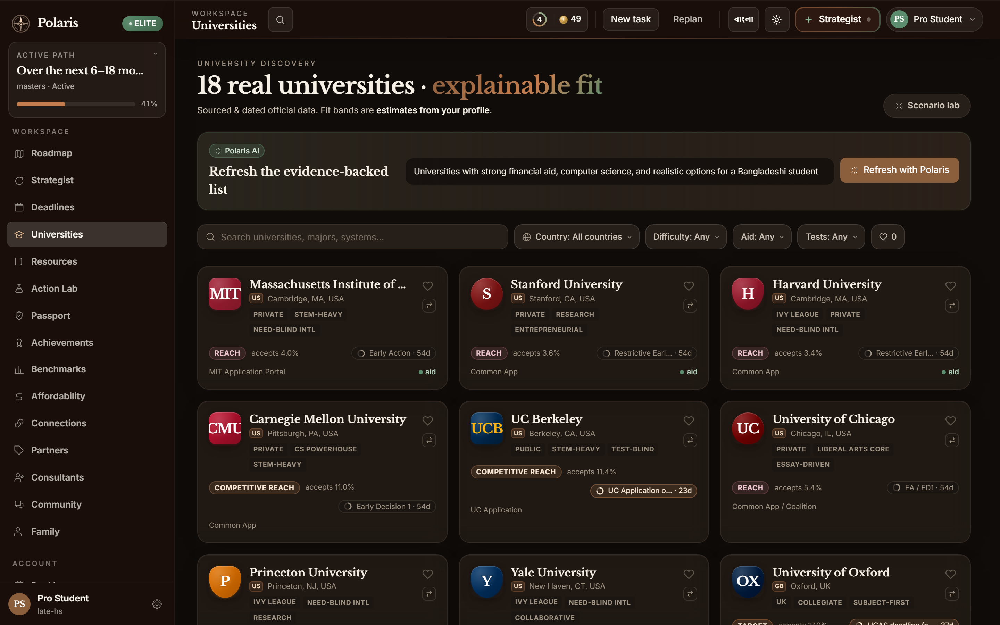

**Decision Twin**


**Evidence Graph**

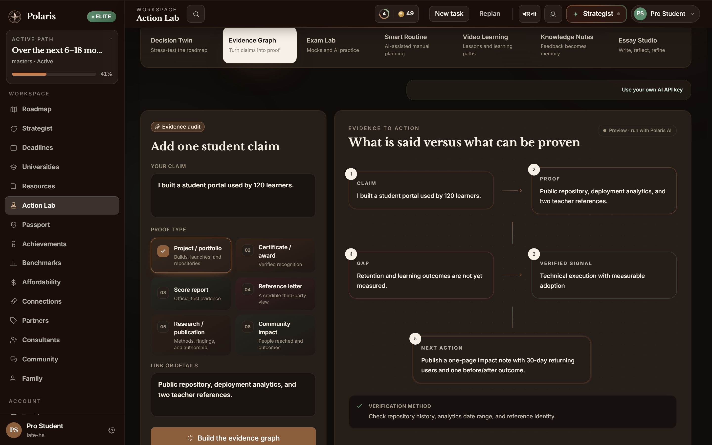

**Essay Studio**

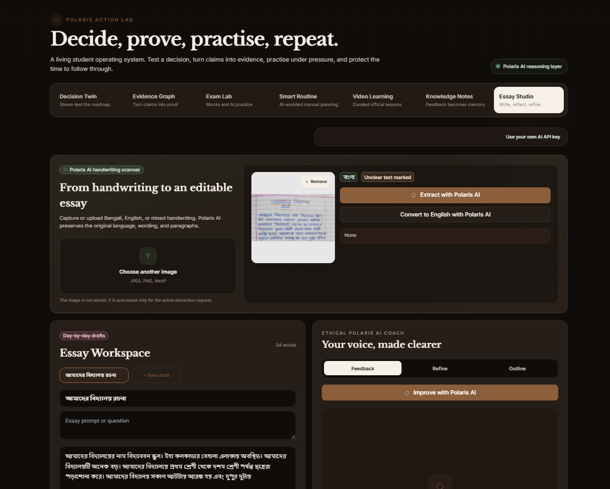

**Resource hub**

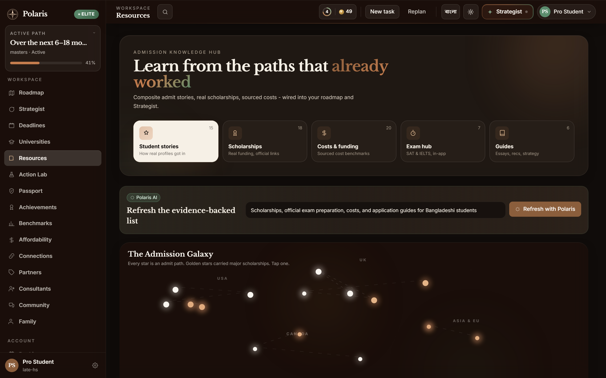

**Connected progress**

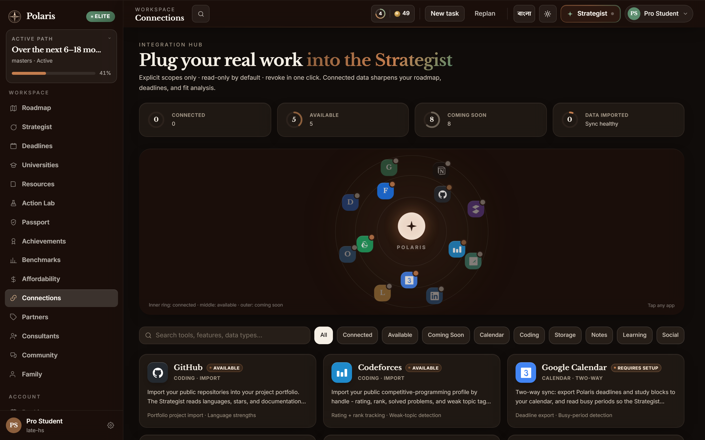

**Plans and checkout**

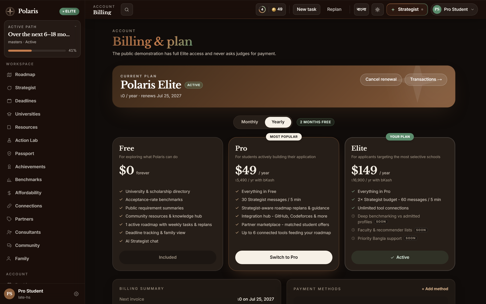

</details>

Workspace screenshots are captured at 2× from the public `/demo` routes by `npm run screenshots -- --scale 2`, with the docked Strategist panel closed, so they use seeded data and never contain a real student's name, email, or plan. The ASL, library, and Exam Lab images were captured by hand from a signed-in test account using public lesson material. [Screenshot notes →](docs/screenshots/README.md)

---

## Quick start

### Application

Use Node.js 22 or newer, npm, a MongoDB connection, and a matching Clerk publishable/secret key pair.

```bash
git clone https://github.com/DesignNovae/Polaris.git
cd Polaris
npm ci
```

Copy `.env.local.example` to `.env.local`:

```powershell
# PowerShell
Copy-Item .env.local.example .env.local
```

```bash
# macOS / Linux
cp .env.local.example .env.local
```

Configure the application credentials, then start it:

```dotenv
MONGODB_URI=your_mongodb_connection_string
NEXT_PUBLIC_CLERK_PUBLISHABLE_KEY=your_clerk_publishable_key
CLERK_SECRET_KEY=your_clerk_secret_key
```

```bash
npm run dev
```

Open [localhost:3000](http://localhost:3000). The authenticated workspace uses MongoDB. `/demo` provides seeded product views, but the application still loads its environment configuration; it is not a replacement for configuring the required keys. Some live Action Lab features require sign-in.

### Optional AI guidance

Set `GEMMA_API_KEY` in `.env.local` to enable the Google AI Studio integration. Prepare the retrieval corpus with:

```bash
npm run rag:ingest
```

Optional provider failures have feature-specific fallbacks. Authentication and database configuration are still required for the full workspace.

### Optional local ASL worker

The signing service requires additional Python/CUDA dependencies, model checkpoints, FFmpeg, and your separately obtained SMPL-X model. These assets are not installed by `npm ci` and are not committed to this repository.

Follow the [complete signing setup](docs/SIGN_LANGUAGE_PRODUCTION.md), then run this in a second terminal:

```bash
npm run signing:worker
```

Enable the interpreter in Video Learning or IELTS Listening. The application and worker currently run on the same machine. The documented configuration has been exercised on an **RTX 3070 with 8 GB VRAM**; timing varies with source media, model initialization, and workload.

## Architecture

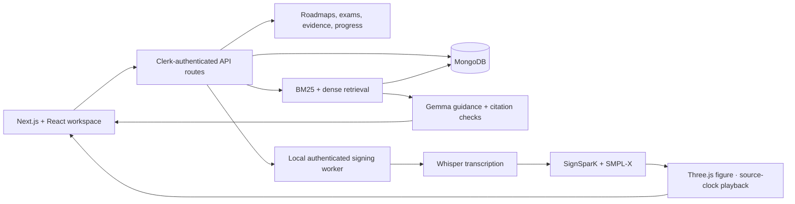
```mermaid
flowchart LR
    UI["Next.js + React workspace"] --> API["Clerk-authenticated API routes"]
    API --> DB[("MongoDB")]
    API --> PLAN["Roadmaps, exams, evidence, progress"]
    API --> RAG["BM25 + dense retrieval"]
    RAG --> DB
    RAG --> AI["Gemma guidance + citation checks"]
    AI --> UI
    API --> WORKER["Local authenticated signing worker"]
    WORKER --> ASR["Whisper transcription"]
    ASR --> MOTION["SignSparK + SMPL-X"]
    MOTION --> VIEW["Three.js figure · source-clock playback"]
    VIEW --> UI
```

| Layer | Technology |
| --- | --- |
| Web application | Next.js 15, React 19, TypeScript |
| Interface | Tailwind CSS, Framer Motion, GSAP, Lenis |
| Identity and data | Clerk, MongoDB, Zod |
| AI guidance | Gemma through Google AI Studio; server-sent events |
| Retrieval | BM25, dense embeddings, weighted reciprocal-rank fusion |
| Sign production | Python, FastAPI, PyTorch, Whisper, SignSparK, SMPL-X |
| Avatar rendering | Three.js with buffered geometry synchronized to media time |
| Optional infrastructure | Upstash Redis, Tavily, notification providers, SSLCommerz |

```text
app/                    Pages, layouts, exam runners, and API routes
components/learning/    Lesson library and account progress UI
components/             Workspace, interpreter, exam, and shared components
data/learning/          Curated lesson metadata and additions
lib/learning/           Catalog, paths, filtering, and progress contracts
lib/interpreter/        Signing contracts, worker bridge, and playback support
lib/exams/              Exam assembly, sessions, scoring, and results
lib/rag/                Retrieval, embeddings, evaluation, and answer checks
lib/roadmap/            Planning, adaptation, and scheduling
lib/progress/           One recorder feeding streak, points, counters, badges
lib/xp/                 Effort-point weights, daily cap, levels
lib/badges/             Evidence achievement catalogue and awarding
lib/coins/              Coin wallet and the shop
services/signing/       Local GPU inference service and Python tests
scripts/                Model setup, catalog audits, screenshots, and evaluation
tests/                  TypeScript regression suites
docs/                   Technical documentation and product screenshots
```

## Configuration

Use [`.env.local.example`](.env.local.example) for application settings and the [signing guide](docs/SIGN_LANGUAGE_PRODUCTION.md) for worker settings. Never commit real credentials or licensed model files.

| Setting | Purpose |
| --- | --- |
| `MONGODB_URI` | Authenticated application data. |
| `NEXT_PUBLIC_CLERK_PUBLISHABLE_KEY`, `CLERK_SECRET_KEY` | Matching Clerk instance credentials. Only the publishable key belongs in browser code. |
| `APP_URL` | Canonical public origin, including payment callback generation. |
| `GEMMA_API_KEY`, `GEMMA_MODEL` | AI guidance and supported model selection. |
| `CLERK_WEBHOOK_SIGNING_SECRET` | Verify Clerk webhook events. |
| `UPSTASH_REDIS_REST_URL`, `UPSTASH_REDIS_REST_TOKEN` | Shared rate limits across application instances. |
| `TAVILY_API_KEY` | Optional web retrieval. |
| `ADMIN_EMAILS` | Administrative access allowlist. |
| `SSLCOMMERZ_*` | Optional payment gateway configuration. |
| `POLARIS_SIGNING_TOKEN`, `POLARIS_SMPLX_PATH` | Server-only worker authentication and licensed model location. |

## Development and verification

| Command | Purpose |
| --- | --- |
| `npm run dev` | Run the web application locally. |
| `npm run build` | Compile and validate the production application. |
| `npm run start` | Serve an existing production build. |
| `npm run lint` | Run ESLint with zero warnings allowed. |
| `npm test` | Run the TypeScript/Node regression suites. |
| `npm run signing:worker` | Start the configured local signing service. |
| `npm run signing:test` | Run Python signing tests using the documented Windows environment. |
| `npm run rag:test` | Run deterministic retrieval self-tests. |
| `npm run rag:eval` | Evaluate retrieval; requires the configured corpus and providers. |
| `npm run screenshots -- --scale 2` | Recapture the public demo targets at retina resolution. |

Focused library and interpreter checks:

```bash
node --import ./tests/register.mjs --test --test-isolation=none tests/learning.library.test.ts tests/interpreter.live.test.ts tests/interpreter.model.test.ts
```

The suites cover catalog and learning-path integrity, progress validation, media timing, ownership, exam access, scoring, and other domain contracts. Real GPU regression tests are opt-in; see the signing guide for measured runs and reproduction commands. Test counts and timings depend on the checkout and environment, so this README does not serve as a live CI status badge.

## Deployment

The Next.js application can be deployed to Vercel. Configure `MONGODB_URI`, `NEXT_PUBLIC_CLERK_PUBLISHABLE_KEY`, and `CLERK_SECRET_KEY` in the **environment being deployed**. Production settings do not automatically configure Preview; branch-specific Preview settings must match the branch.

`npm run build` runs a hosted-environment check before compilation. Missing Clerk keys intentionally fail the build. Use matching test keys for a test instance or matching live keys for a live instance. Legacy `NEXTAUTH_*` variables do not configure Clerk.

Configure `APP_URL`, MongoDB network access, and any enabled webhook, payment, notification, or retrieval providers before using their features. Use a shared rate-limit store for deployments with multiple instances.

**ASL deployment is separate.** The current web-to-worker bridge calls `127.0.0.1:8765`; Vercel cannot use that address to reach your PC. Hosting live signing requires a secured GPU service and changes to remote media transfer and worker configuration. A cloud GPU deployment or public tunnel is not included in the current implementation.

## Security, privacy, and limitations

- Authentication, role checks, and exam ownership are enforced on the server. Learning progress is scoped to the signed-in account.
- Signing requests require a server-only bearer token and owner identity. The worker limits uploads and concurrent jobs and removes expired job directories.
- The current signing worker is designed for local use. Public exposure requires additional isolation, access controls, and resource limits.
- Published student passports use unlisted URLs; teacher and family views apply role-specific scopes.
- Acceptance estimates and AI-generated practice are advisory. They are not admissions guarantees or official exam scores.
- Video metadata is checked when the catalog is refreshed. A third-party uploader can later remove a video or change embedding availability.
- ASL accuracy depends on transcription and model output. BSL and ISL are not supported in the live production path; generated signing needs an ASL-fluent review.
- The released SignSparK checkpoints have non-commercial research restrictions. SMPL-X requires its own registration and license acceptance; do not redistribute the model files. See the [upstream sources and license links](docs/SIGN_LANGUAGE_PRODUCTION.md#sources).
- Retrieval evaluation results and their dataset scope are documented in [RAG.md](docs/RAG.md). They should not be interpreted as guarantees for every question.

## Documentation

- [Learning library and catalog maintenance](docs/LEARNING_LIBRARY.md)
- [Sign language production, setup, benchmarks, and limitations](docs/SIGN_LANGUAGE_PRODUCTION.md)
- [Retrieval and grounding](docs/RAG.md)
- [Screenshot capture notes](docs/screenshots/README.md)
- [Environment template](.env.local.example)
- [Feature access rules](lib/features.ts)

Polaris is an actively developed university/research project. Feature availability depends on the configured services, account access, and deployment environment.
