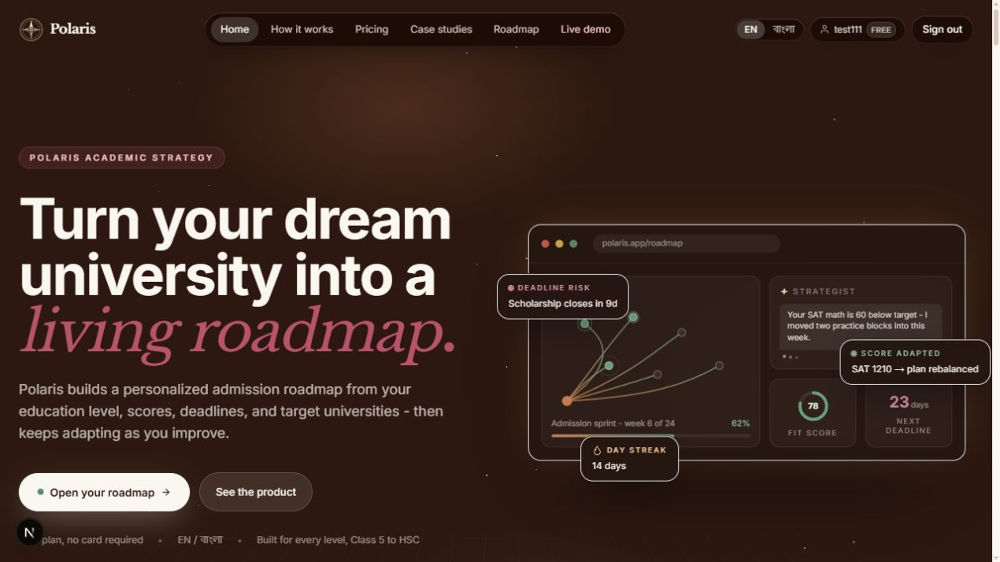
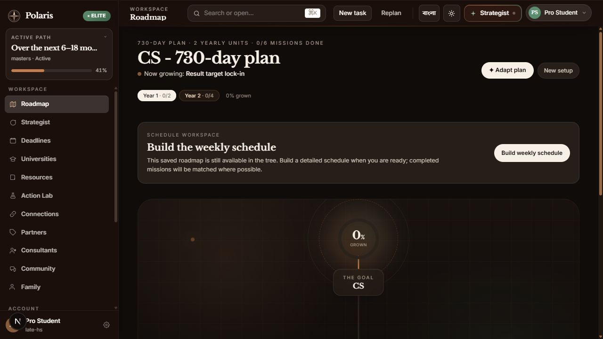
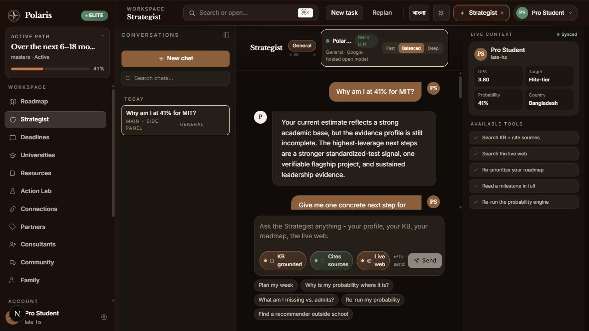
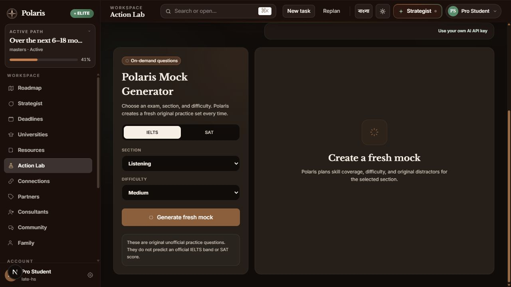
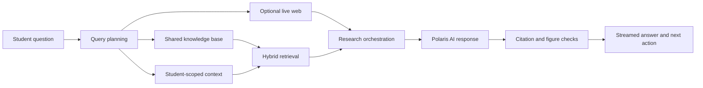

# Polaris

Polaris is a bilingual academic strategy platform that turns a student's goals, profile, deadlines, and evidence into a living admissions roadmap. It combines adaptive planning, grounded AI guidance, university discovery, practice tools, and progress tracking in one workspace.

Built with Next.js 15, React 19, TypeScript, MongoDB, and a retrieval-augmented Polaris AI layer.

## Product overview



Polaris is designed around one continuous workflow:

1. Capture the student's academic profile and target.
2. Generate a multi-year roadmap with concrete milestones.
3. Turn the roadmap into weekly work.
4. Use the Strategist to investigate gaps and prioritize the next action.
5. Track deadlines, evidence, practice, and progress as the plan evolves.

The public demo is available at `/demo` and does not require a database connection.

## Main features

- **Adaptive roadmap** — builds a goal-oriented multi-year plan, schedules weekly work, and supports replanning as constraints change.
- **Grounded Strategist** — streams profile-aware guidance backed by the shared knowledge base, student memory, roadmap context, citations, and optional live-web retrieval.
- **Action Lab** — provides original mock exams, smart routines, curated learning, knowledge notes, and writing support.
- **University intelligence** — combines university and scholarship discovery with requirements, fit signals, and acceptance benchmarks.
- **Deadline and progress tracking** — manages milestones, recurring work, streaks, and deadline risk from a unified workspace.
- **Community and expert support** — includes community channels, consultant discovery, bookings, and partner offers.
- **Connected progress** — integrates external services and feeds verified progress signals back into the student's plan.
- **Family visibility** — gives linked family members a focused view of progress and upcoming work.
- **English and Bengali** — supports bilingual navigation and product guidance across the application.

## Product screenshots

### Adaptive roadmap

The roadmap connects long-horizon objectives to yearly missions and a buildable weekly schedule.



### Grounded Strategist

The Strategist combines the student's profile, roadmap, memory, retrieved sources, and optional web research to produce cited, actionable guidance.



### Action Lab — mock exams

Action Lab can generate original IELTS and SAT practice sets by section and difficulty.



## How the Strategist works



The retrieval pipeline combines BM25 and dense-vector search through weighted reciprocal-rank fusion. It degrades to lexical retrieval when embeddings are unavailable and keeps student material isolated by `userId`. See [docs/RAG.md](docs/RAG.md) for the retrieval design, evaluation commands, measurements, and failure behavior.

## Technology

| Area | Implementation |
| --- | --- |
| Application | Next.js App Router, React, TypeScript |
| Styling and motion | Tailwind CSS, Framer Motion, GSAP |
| Authentication | NextAuth with credentials and optional OAuth providers |
| Data | MongoDB |
| Validation | Zod |
| AI | Google-hosted model integration with server-sent event streaming |
| Retrieval | Hybrid BM25 and dense-vector search with optional reranking |
| Payments | Optional LemonSqueezy subscriptions and webhooks |
| Content | Markdown, GFM, mathematical notation, and KaTeX |

## Repository structure

```text
app/                    Next.js pages, layouts, metadata, and API routes
components/             Product, workspace, landing, and shared UI components
data/                   Seed universities, scholarships, case studies, and eval data
docs/                   Technical documentation and product screenshots
lib/
  action-lab/           Action Lab data and contracts
  billing/              Plan catalog and subscription services
  db/                   MongoDB collections and indexes
  i18n/                 English/Bengali localization
  llm/                  Model routing and provider adapters
  rag/                  Ingestion, retrieval, reranking, and evaluation
  strategist/           Research orchestration, prompts, tools, memory, and streaming
public/                 Public static assets
scripts/                RAG ingestion, evaluation, calibration, and self-tests
```

## Getting started

### Prerequisites

- A current Node.js LTS release
- npm
- MongoDB for authenticated workspace features
- A supported Google AI API key for generated AI responses

### Installation

```bash
git clone https://github.com/DesignNovae/Polaris.git
cd Polaris
npm install
```

Create the local environment file:

```powershell
Copy-Item .env.local.example .env.local
```

On macOS or Linux:

```bash
cp .env.local.example .env.local
```

At minimum, configure `MONGODB_URI` and `NEXTAUTH_SECRET` for the authenticated application. The public demo can run without MongoDB.

Start the development server:

```bash
npm run dev
```

Open `http://localhost:3000` for the landing page or `http://localhost:3000/demo` for the seeded product demo.

## Environment configuration

Use [.env.local.example](.env.local.example) as the source of truth. Do not commit `.env.local` or production secrets.

| Variable | Required | Purpose |
| --- | --- | --- |
| `MONGODB_URI` | Workspace | MongoDB connection used by authenticated features |
| `NEXTAUTH_SECRET` | Workspace | Signs authentication tokens and sessions |
| `NEXTAUTH_URL` | Production | Canonical application URL for authentication callbacks |
| `GEMMA_API_KEY` | AI features | Server-side Google AI key; the legacy variable name is retained for compatibility |
| `GEMMA_MODEL` | Optional | Selects an allowed text-generation model |
| `TAVILY_API_KEY` | Optional | Enables non-generative live-web retrieval in Research mode |
| `GOOGLE_CLIENT_ID`, `GOOGLE_CLIENT_SECRET` | Optional | Enables Google OAuth |
| `FACEBOOK_CLIENT_ID`, `FACEBOOK_CLIENT_SECRET` | Optional | Enables Facebook OAuth |
| `ADMIN_EMAILS` | Optional | Comma-separated administrator allowlist |
| `LEMONSQUEEZY_*` | Optional | Enables checkout, subscription management, and webhook verification |
| `RAG_*` | Optional | Tunes embeddings, fusion, reranking, second-pass retrieval, and eval pacing |

Generate `NEXTAUTH_SECRET` with a cryptographically secure random value. Keep all AI, database, OAuth, and payment credentials server-side.

## Available commands

| Command | Purpose |
| --- | --- |
| `npm run dev` | Start the Next.js development server |
| `npm run build` | Create an optimized production build |
| `npm run start` | Serve the production build |
| `npm run lint` | Run ESLint with zero warnings allowed |
| `npm run rag:test` | Run deterministic, database-free retrieval self-tests |
| `npm run rag:ingest` | Ingest or update retrieval documents |
| `npm run rag:eval` | Measure retrieval recall and ranking quality |
| `npm run rag:faith` | Evaluate citation validity and answer grounding |
| `npm run rag:calibrate` | Calibrate the groundedness judge against labeled fixtures |

## Production checklist

Before deploying:

```bash
npm run lint
npx tsc --noEmit --incremental false
npm run rag:test
npm run build
```

Also verify the following:

- Production secrets are configured in the deployment environment.
- `NEXTAUTH_URL` matches the public origin.
- OAuth callback URLs match the production domain.
- The LemonSqueezy webhook endpoint points to `/api/webhooks/lemonsqueezy` when billing is enabled.
- MongoDB network access and indexes are ready for the production environment.
- The RAG corpus has been ingested after changing the embedding model or dimensions.
- Admin access is restricted through `ADMIN_EMAILS`.

## Reliability and privacy

- AI credentials remain on the server; browser-provided keys are handled only by the explicitly labeled personal-key workflow.
- Student retrieval rows are scoped by `userId` and removed with the associated account.
- AI and retrieval integrations degrade gracefully when optional services are unavailable.
- Strategist output passes deterministic citation and unsupported-figure checks before completion.
- Feature access and plan limits are enforced in application code, not only hidden in the interface.
- API input is validated with Zod and protected routes enforce authenticated roles or plan requirements.

## Further documentation

- [Retrieval and grounding](docs/RAG.md)
- [Environment template](.env.local.example)
- [Feature access map](lib/features.ts)
- [Plan catalog](lib/billing/plans.ts)

## Status

Polaris is under active development. Interfaces, pricing, and integration behavior may change while the platform is being prepared for production deployment.
